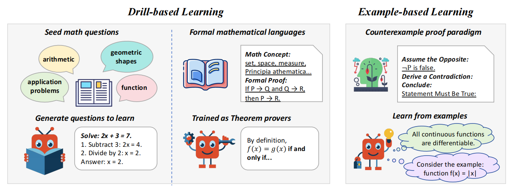

# 🧮 COUNTERMATH: Counterexample-Driven Conceptual Reasoning in Mathematical LLMs
*One Example Shown, Many Concepts Known! Counterexample-Driven Conceptual Reasoning in Mathematical LLMs*

Inspired by the pedagogical method of **"proof by counterexamples"** widely used in human mathematics education, our work aims to enhance Large Language Models’ (LLMs) ability to conduct **mathematical reasoning and proof construction** through counterexamples.

Introducing **COUNTERMATH**, a high-quality, university-level mathematical benchmark designed to test whether models can understand abstract mathematical concepts and disprove false statements using counterexamples — a crucial skill in real-world mathematical thinking.

📘 This benchmark evaluates not just computational abilities, but also deep conceptual understanding — something that even advanced LLMs often struggle with.



---

## 📚 Benchmark Data

All evaluation data for COUNTERMATH is stored in the `data/` folder. The main dataset file is:

```
data/countermath_ver1.1.jsonl
```

You can load it directly into your scripts or evaluation pipelines depending on your use case.

---

## 🤖 Model Evaluation

Evaluation code resides under the `experimental/` directory.

### For Open-Source Models

Modify the paths and model names in the following files:

- `eval.sh`
- `baseline-eval.py`

Then run:

```bash
bash experimental/eval.sh
```

### For Closed-Source Models (e.g., GPT-4)

Use the API-based evaluation script:

```bash
python experimental/API_call.py
```

This will send requests to the specified API endpoint and collect responses for further analysis.

---

## 📊 Automatic Metric Calculation (F1 Score)

To compute the F1 score across different domains and overall performance:

```bash
python evaluation_field.py
```

This script provides per-category and aggregated F1 scores, giving detailed insights into model strengths and weaknesses.

---

## 🔍 Example Evaluation Workflow

### ⚙️ Configure OpenAI API Key and Base URL

#### 1. Set your API key:

Edit the `config/api_config.json` file to include your OpenAI API key.

```json
{
  "openai": {
    "api_key": "your-api-key-here"
  }
}
```

#### 2. Set the request base URL:

In `Example_eval/eval_rationale.py`, line 23, configure the base URL as needed:

```python
client = OpenAI(
    api_key=json.load(open('config/api_config.json'))['openai']['api_key'],
    base_url='URL' 
)
```

### 🧾 Generate Evaluation Results

After configuration, you can evaluate the reasoning steps generated by models like GPT-4o.

#### 1. Set the output files to be evaluated in the shell script:

Edit `FILES` variable in the script accordingly.

#### 2. Run the evaluation script:

```bash
# English evaluation
bash Example_eval/run_eval.sh

# Chinese evaluation
bash Example_eval/run_eval_zh.sh
```

### 📈 Compute Reasoning Accuracy

Once evaluations are completed, calculate final accuracy scores:

```bash
bash Example_eval/show_result.sh
```

This will display the reasoning accuracy based on GPT-4o’s assessment of the generated reasoning chains.

---

## 🔧 Model Training

Training data and scripts are located in the `training/` folder.

### Preparing Training Data

Convert the raw training file:

```
training/output_counterproof_overrall.jsonl
```

into a standard format such as Alpaca or ShareGPT before fine-tuning.

### Fine-Tuning Qwen2.5-Math-Instruct-7B

#### 🔄 LoRA Fine-Tuning

Use the provided config file to start LoRA fine-tuning:

```bash
llamafactory-cli train qwen2-7b-lora-sft.yaml
```

#### 🧱 Merge Weights

After fine-tuning, merge the LoRA weights with the base model:

```bash
llamafactory-cli export qwen2-7b-merge-lora.yaml
```

This generates a merged checkpoint ready for deployment or evaluation.

---

## ✅ Highlights

- 🎯 Real-world math reasoning via **counterexamples**
- 📈 Challenging, concept-driven questions at **university level**
- 🛠️ Modular structure for both open-source and closed-source model evaluation
- 📊 Comprehensive metrics including **F1 score** and **reasoning accuracy**

---

## 📌 Future Work

- Expand the dataset to cover more mathematical domains
- Integrate more LLMs and fine-tuning strategies
- Explore interactive learning with dynamic feedback

